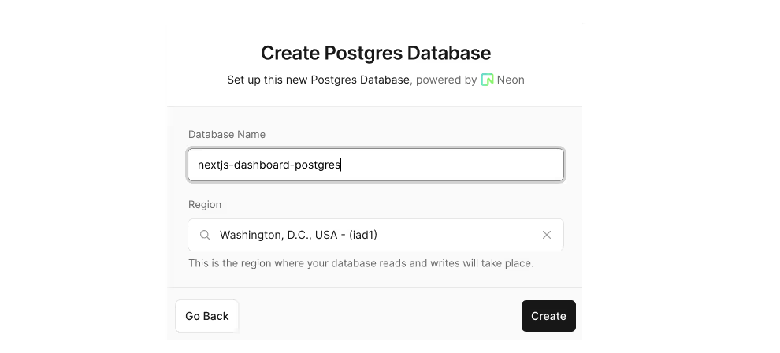

## Chapter 1 - Create a New Project

安装`pnpm`，通常来说比`npm`和`yarn`更快，更方便管理项目
```bash
npm install -g pnpm
```

创建一个Next.js app然后`cd`到该项目根目录下面：
```bash
npx create-next-app@latest nextjs-dashboard --example "https://github.com/vercel/next-learn/tree/main/dashboard/starter-example" --use-pnpm
```

```bash
cd nextjs-dashboard
```

在开发环境中测试当前app
```bash
pnpm i
pnpm dev
```
然后打开http://localhost:3000/


## Chapter 2 - CSS Styling
主要讲述：
- 如何添加global CSS 文件
  - 该项目中`/app.ui`文件夹下面的`global.css`中定义了全局格式。在`/app/layout.tsx`中导入`global.css`即可使用
  ```tsx
  //  /app/layout.tsx 
  import '@/app/ui/global.css';
 
  export default function RootLayout({
    children,
  }: {
    children: React.ReactNode;
  }) {
    return (
      <html lang="en">
        <body>{children}</body>
      </html>
    );
  }
  ```
- Tailwind和CSS Modules 这两种CSS styling的方式
  - 下面是使用tailwind的案例：
  ```tsx
  // /app/page.tsx
  import AcmeLogo from '@/app/ui/acme-logo';
  import { ArrowRightIcon } from '@heroicons/react/24/outline';
  import Link from 'next/link';
  
  export default function Page() {
    return (
      // These are Tailwind classes:
      <main className="flex min-h-screen flex-col p-6">
        <div className="flex h-20 shrink-0 items-end rounded-lg bg-blue-500 p-4 md:h-52">
      // ...
    )
  }
  ```
  然后将下面的代码添加到`/app/page/tsx`文件的`<p>` tag上面一行：
  ```tsx
  <div
    className="relative w-0 h-0 border-l-[15px] border-r-[15px] border-b-[26px] border-l-transparent border-r-transparent border-b-black"
  />
  ```
  - 下面是如何使用css module。首先是要在`/app/ui`文件夹下面创建一个`home.module.css`文件，并添加下面代码：
  ```css
  .shape {
    height: 0;
    width: 0;
    border-bottom: 30px solid black;
    border-left: 20px solid transparent;
    border-right: 20px solid transparent;
  }
  ```
  然后在`/app/page.tsx`下面：
  ```tsx
  import AcmeLogo from '@/app/ui/acme-logo';
  import { ArrowRightIcon } from '@heroicons/react/24/outline';
  import Link from 'next/link';
  import styles from '@/app/ui/home.module.css';
  
  export default function Page() {
    return (
      <main className="flex min-h-screen flex-col p-6">
        <div className={styles.shape} />
      // ...
    )
  }
  ```
  这样就表示将`.shape`所有的样式都赋予给`<div>` tag。
- 如何通过`clsx`包 来添加 conditional class。最常见的就是invoice的状态可以是'pending'或者'paid'。`/app/ui/invoice/status.tsx`中就定义了invoice状态变动的条件，如下：
  ```tsx
  import clsx from 'clsx';

  export default function InvoiceStatus({ status } : { status : string}) {
    return (
      <span
        className={clsx(
          'inline-flex items-center rounded-ful px-2 py-1 text-sm',
          {
            'bg-gray-100 text-gray-500': status === 'pending',
            'bg-green-500 text-white': status === 'paid',
          },
          )}
      >
      // ...
    )
  }
  ```


## Chapter 3 - Optimizing Fonts and Images
### 3.1. 如何在`next/font`中添加自定义的字体？
优化字体主要就是出于对网站performance的考量。Google使用的指标是[Cumulative Layout Shift](https://vercel.com/blog/how-core-web-vitals-affect-seo)，来衡量一个网站的performance和user experience。使用Next.js的好处是，它通过`next/font`来自动优化你网站的字体。

1. **Adding a Primary Font**: 在`app/ui`文件夹下面创建`fonts.ts`，然后添加下面代码：
```ts
import { Inter } from 'next/font/google'

export const Inter = Inter({ subsets: ['latin'] });
```
最后，将刚刚创建的`Inter`字体导入`/app/layout.tsx`如下：
```tsx
import '@/app/ui/global.css';
import { inter } from '@/app/ui/fonts';
 
export default function RootLayout({
  children,
}: {
  children: React.ReactNode;
}) {
  return (
    <html lang="en">
      <body className={`${inter.className} antialiased`}>{children}</body>
    </html>
  );
}
```

2. **Adding a Secondary Font**：
对`/app/ui/fonts.ts`进行如下修改。注意的是Lusitana字体要求给定`weight`参数（详见Google Fonts）
```tsx
// /app/ui/fonts.ts
import { Inter, Lusitana } from 'next/font/google';
 
export const inter = Inter({ subsets: ['latin'] });   // priamry font

// weight parameter is necessary because it's required by Google Font
export const lusitana = Lusitana({ subsets: ['latin'], weight: ['400', '700'] }); // secondary font

```
### 3.2. 如何在`next/image`中添加图片？
Next.js提供了static assets，例如图片等。它们被放在`/public`文件夹下面。
```tsx

```

这也就意味着你需要手动配置如下条目：
* 确保图片在不同屏幕大小下是responsive的
* 为不同大小的设备指定图片大小
* 防止页面layout随着图片的加载发生shift
* lazy load位于用户viewport之外的图片

1. `<Image>` Component

2. 添加desktop hero image - `/public`文件夹下面有`hero-desktop.png`和`hero-mobile.png`两个图片。在`/app/page.tsx`中：
```tsx
import AcmeLogo from '@/app/ui/acme-logo';
import { ArrowRightIcon } from '@heroicons/react/24/outline';
import Link from 'next/link';
import { lusitana } from '@/app/ui/fonts';
import Image from 'next/image';       // newly added 
 
export default function Page() {
  return (
    // ...
    <div className="flex items-center justify-center p-6 md:w-3/5 md:px-28 md:py-12">
      {/* Add Hero Images Here */}
      <Image             // newly added 
        src="/hero-desktop.png"
        width={1000}
        height={760}
        className="hidden md:block"
        alt="Screenshots of the dashboard project showing desktop version"
      />
    </div>
    //...

    // Practice - Adding another image:
    <div className="flex items-center justify-center p-6 md:w-3/5 md:px-28 md:py-12">
      <Image 
        src="/hero-mobile.png"
        width={560}
        height={620}
        className="block md:hidden"
        alt="Screenshots of the dashboard project showing mobile version"
      />
    </div>
  );
}
```
上面代码里将图片大小设置成1000x760，这样可以避免layout shift。
上面的`hidden`类表示将 该图从手机屏幕的DOM上移除。`md:block`表示在桌面端屏幕上显示该图片

### 3.3. 如何在Next.js中优化字体和图片？
上面的 `//Practice` 的部分值得一看。此外就是对于`md:hidden`的使用。这里表示当用户使用了桌面端则显示`/hero-desktop.png`，如果是移动端则显示`/hero-mobile.png`。


## Chapter 4 - Creating Layouts and Pages

Next.js使用的是**file-system routing**，文件夹用来创建嵌套式的路由。每个文件夹都表示一个**route segment**，它会映射到一个**URL segment**

此外，前面多次提到的`page.tsx`和`layout.tsx`是用来为每个 route 创建UI的。`page.tsx`可以导出一个React Component。`/app/page.tsx`文件是一个连接到`/`路由的homepage。

要创建嵌套式路由，你可以在每一个文件夹下面都创建一个`page.tsx`


我们尝试创建新的`/app/dashboard/page.tsx`文件如下：
```tsx
export default function Page() {
  return <p>Dashboard Page</p>;
}
```

然后创建新的`/app/dashboard/customers/page.tsx`和`/app/dashboard/invoices/page.tsx`文件如下：
```tsx
export default function Page() {
  return <p>Customers Page.</p>
}
```

```tsx
export default function Page() {
  return <p>Invoices Page.</p>
}
```

然后你就可以看到刚刚创建的http://localhost:3000/dashboard，http://localhost:3000/dashboard/customers 和 http://localhost:3000/dashboard/invoices 这三个页面了。


### Creating the dashboard Layout
Dashboard中包含的是多个页面之间共享的navigation。在Next.js中，你可以通过`layout.tsx`文件来创建多个页面之间共享的UI。我们来看下面的例子：

首先在`/dashboard`文件夹下面创建一个新的文件`layout.tsx`
```tsx
import SideNav from '@/app/ui/dashboard/sidenav';

export default function Layout({ children }: { children: React.ReactNode }) {
  return (
    <div className="flex h-screen flex-col md:flex-row md:overflow-hidden">
      <div className="w-full flex-none md:w-64">
        <SideNav />
      </div>

      <div className='flex-grow p-6 md:overflow-y-auto md:p-12'>{children}</div>
    </div>
  );
}
```
这段代码中，我们先导入了`<SideNav />`组件。被导出的`<Layout />`组件会接受一个`children` prop。该prop可以是一个 page也可以是另一个layout。在上面代码案例中，`/dashboard`文件夹里面的pages会自动被嵌套在一个`<Layout />`组建中。即，如下图所示，你会看到`/dashboard`下面的`invoices/page.tsx`和`customers/page.tsx`以及`/dashboard/page.tsx`三个页面都自动被嵌套在`/dashboard/layout.tsx`下面了。最终效果如下图：


使用layouts的一大优点就是在navigation中，只有page 组件会被更新，而layout本身不会被re-render，这也就是所谓的partial rendering。这样一来就能保留下client-side 的React state。


### Root Layout
在Chapter 3中，我们倒入了`Inter`字体到另一个layout `/app/layout.tsx`中，如下：
```tsx
import '@/app/ui/global.css';
import { inter } from '@/app/ui/fonts';
 
export default function RootLayout({
  children,
}: {
  children: React.ReactNode;
}) {
  return (
    <html lang="en">
      <body className={`${inter.className} antialiased`}>{children}</body>
    </html>
  );
}
```
该方式称为[root layout](https://nextjs.org/docs/app/api-reference/file-conventions/layout#root-layouts)，且在每一个Next.js应用中都需要这样做。任何被添加到`root layout`中的UI都会在你的应用中的每一个page之间被共享。


## Chapter 5 - Navigating Between Pages
1. How to use the next/link component.
2. How to show an active link with the usePathname() hook.
3. How navigation works in Next.js.

### Why Optimize Navigation?
传统网站都是用`<a></a>`来建立各个页面之间的联系。但是在我们创建的应用中，当我们在customers, home, invoices页面之间切换时，每次切换，页面都会fully refresh。


### The `<Link>` Component
在Next.js中，你可以使用`<Link />`组件建立页面之间的连接。这可以让你使用Javascript进行client-side navigation。你可以打开`/app/ui/dashboard/nav-links.tsx`文件，导入`<Link />`组件，然后将`<a>`替换成`<Link />`。如下：
```tsx
// /app/ui/dashboard/nav-links.tsx
import {
  UserGroupIcon,
  HomeIcon,
  DocumentDuplicateIcon,
} from '@heroicons/react/24/outline';
import Link from 'next/link';
 
// ...
 
export default function NavLinks() {
  return (
    <>
      {links.map((link) => {
        const LinkIcon = link.icon;
        return (
          <Link
            key={link.name}
            href={link.href}
            className="flex h-[48px] grow items-center justify-center gap-2 rounded-md bg-gray-50 p-3 text-sm font-medium hover:bg-sky-100 hover:text-blue-600 md:flex-none md:justify-start md:p-2 md:px-3"
          >
            <LinkIcon className="w-6" />
            <p className="hidden md:block">{link.name}</p>
          </Link>
        );
      })}
    </>
  );
}
```
使用`<Link>`的好处就是，如果你再去你的网页上切换invoices, customers, home，页面不再是fully refresh了。这是因为：
1. 为了提高navigation 性能，Next.js会根据路由段(route segments)自动对应用进行代码拆分。这与传统的[React SPA](https://nextjs.org/docs/app/building-your-application/upgrading/single-page-applications)不同，在传统的React SPA中，浏览器在初始页面加载时加载所有应用程序代码。
按路由分割代码意味着页面被隔离。如果某个页面抛出错误，应用程序的其余部分仍将正常工作。这也减少了浏览器解析的代码，从而使应用程序更快。
此外，在生产环境中，只要`<Link>`组件出现在浏览器的视图中，Next.js就会自动在后台预取链接路由的代码。当用户单击链接时，目标页面的代码已经在后台加载，这使得页面转换几乎是即时的！


### Pattern: Showing active links
常见的UI Pattern是要显示一个active link来告诉用户他们当前所在的位置。这就需要获取的用户当前的URL path。Next.js提供了一个hook `usePathname()`，用来检查该path并且实现该pattern。

由于`usePathname()`是一个React hook，所以需要将`nav-links.tsx`转换成一个`Client` 组件。将React的"use client"指令Tina驾到文件顶部，然后从`/next/navigation`中导入`usePathname()`如下：
```tsx
// /app/ui/dashboard/nav-links.tsx
'use client';

import {
  UserGroupIcon,
  HomeIcon,
  DocumentDuplicateIcon,
} from '@heroicons/react/24/outline';
import Link from 'next/link';
import { usePathname } from 'next/navigation';

// ...
```
然后将该路径分配给`<navLinks />`组件里面的`pathname`如下：
```tsx
// /app/ui/dashboard/nav-links.tsx
export default function NavLinks() {
  const pathname = usePathname();
}
```

使用`clsx`库可以添加 有条件的CSS样式。例如，当`link.href`与`pathname`匹配的时候，该link要显示成蓝色字样。如下：
```tsx
// /app/ui/dashboar/nav-links.tsx
'use client';
 
import {
  UserGroupIcon,
  HomeIcon,
  DocumentDuplicateIcon,
} from '@heroicons/react/24/outline';
import Link from 'next/link';
import { usePathname } from 'next/navigation';
import clsx from 'clsx';
 
// ...
 
export default function NavLinks() {
  const pathname = usePathname();
 
  return (
    <>
      {links.map((link) => {
        const LinkIcon = link.icon;
        return (
          <Link
            key={link.name}
            href={link.href}
            className={clsx(
              'flex h-[48px] grow items-center justify-center gap-2 rounded-md bg-gray-50 p-3 text-sm font-medium hover:bg-sky-100 hover:text-blue-600 md:flex-none md:justify-start md:p-2 md:px-3',
              {
                'bg-sky-100 text-blue-600': pathname === link.href,
              },
            )}
          >
            <LinkIcon className="w-6" />
            <p className="hidden md:block">{link.name}</p>
          </Link>
        );
      })}
    </>
  );
}
```


## Chapter 6 - Setting Up Your Database
该教程将会使用PostgreSQL作为数据库案例。你可以在[Vercel's marketplace integrations](https://vercel.com/marketplace?category=storage)里面找到。当然如果你有自己prefer的数据库的话也可以使用你自己喜欢的数据库。

这章中，我们会讨论：
1. 如何将当前项目push到Github上
2. 设置Vercel账号，然后将其与你的GitHub repo连接，从而方便你实时查看网站的preview和deployment
3. 创建和建立从你的项目到数据库之间的连接
4. 给数据库发送初始化数据

### 创建GitHub repo：
就简单的follow [这篇官方教程](https://docs.github.com/en/repositories/creating-and-managing-repositories/quickstart-for-repositories)来创建GitHub repo即可


### 然后创建一个Vercel账号
选择免费的hobby plan。推荐在创建的过程中建立起Vercel与GitHub帐号之间的联系。最后结果如下图：


<span style="color: cyan">这样做的好处就是你可以每次git push之后，直接看到公开的网站更新，而不是只能在本地查看</span>。另外要注意的是，这个GitHub repo必须是 public的才能看到。

### 创建一个Postgres 数据库


如下图，我们在Storage下面找到数据库。你可以用Neon或者Supabase都可以。




建立连接之后，找到`.env.local`页面，点击**Show secret**和**Copy Snippet**。确保你复制了这些代码


> ⚠️另外需要注意的是，你最好去到`.gitignore`文件下面，确保`.env`文件被添加到`.gitignore`下面，避免重要信息泄漏。

最后，将复制的代码放到`.env.example`文件中。最后将该文件重命名为`.env`

### Seed your database

有了数据库之后，我们创建一个种子来初始化数据。我们包含了一个可以在浏览器中访问的API，它将运行一个种子脚本，用一组初始数据填充数据库。

该脚本使用SQL创建表，并从`placeholder-data.ts`文件中中获取数据。在创建它们之后填充它们。

确保您的本地开发服务器正在运行`pnpm run dev`，并在浏览器中导航到`localhost:3000/seed`。完成后，您将在浏览器中看到一条消息"Database seeded successfully"。完成后，您可以删除此文件。


这时候，如果你再去到 Neon 中所对应的项目下面就会看到你刚刚新创建了几个table如下：


### Executing Queries
这里我们使用另一个Router Handler `app/query/route.ts`来查询数据库。在该文件中你会找到一个叫`listInvoices()`的函数，该函数中有如下一段SQL语句：
```sql
-- /app/query/route.ts
SELECT invoices.amount, customers.name
FROM invoices
JOIN customersON invoices.customer_id = customers.id
WHERE invoices.amount = 666;
```
将该文件的注释去掉后，然后去掉`Response.json()`代码块。然后去到`localhost:3000/query`下面，你就能看到一个invoice的`amount`和`name`的值被返回了。如下：
```tsx
import postgres from 'postgres';

const sql = postgres(process.env.POSTGRES_URL!, { ssl: 'require' });

async function listInvoices() {
	const data = await sql`
    SELECT invoices.amount, customers.name
    FROM invoices
    JOIN customers ON invoices.customer_id = customers.id
    WHERE invoices.amount = 666;
  `;

	return data;
}

export async function GET() {
  // return Response.json({
  //   message:
  //     'Uncomment this file and remove this line. You can delete this file when you are finished.',
  // });
  try {
  	return Response.json(await listInvoices());
  } catch (error) {
  	return Response.json({ error }, { status: 500 });
  }
}
```


## Chapter 7 - Fetching Data
有了数据库之后，我们当然就希望从数据库中获取我们想要的数据，所以这章会讲到：
1. 获取数据的几种方式：APIs, ORMs, SQL, etc.
2. 如何使用Server Components来提高 在访问后端资源时 的安全性
3. 什么是network waterfalls
4. 如何通过JavaScript Pattern来实现 **parallel data fetching**


### Choosing how to fetch data

#### API Layer
APIs是 App代码 与 数据库 之间的一个中间层。API常见的使用场景是：
* 如果你使用了第三方的服务，且该服务有提供API
* 如果你是从client side获取数据，则需要有一个在服务器上运行的API层，以避免向客户机公开数据库机密。

在Next.js中，你可以用[Route Handlers](https://nextjs.org/docs/app/building-your-application/routing/route-handlers)来创建API endpoints。例如上面一章中提到的`localhost:3000/query/`就是一个API endpoint。

#### Database queries
在你要创建一个full-stack App的时候，你就需要写出 与你的数据库进行交互的 逻辑。对于 relational database，你可以使用SQL或者 [ORM](https://vercel.com/docs/storage)来给出交互逻辑。

下面是几个你必须写出database queries的案例：
* 当创建API endpoints的时候，你需要写出与你数据库进行交互的逻辑
* 如果你使用的是React Server Component (能获取server端的数据)，你可以跳过API层，并直接对你的数据库进行查询，而不会有将你的数据库隐秘信息暴露给client端的风险。


### Using Server Compoennts to fetch data
Nexjt.js App默认上时使用`React Server Components`。使用`React Server Components`获取数据是比较新的一种方式，它的好处是：
* `React Server Components`支持Javascript Promises，它针对异步式任务（例如data fetching）提供了原神的解决方案。你可以使用`async/await`语句，而不再需要使用`useEffect`， `useState`或者任何其他data fetching libraries了。
* `React Server Components`是运行在server端上的，所以你可以将expensive的数据获取 和 expensive的逻辑 放在 server端，只需要将结果发送给client端。
* 由于`React Server Components`是运行在server端上的，你可以直接对数据库进行查询，而不需要通过额外的API层。这可以节省你 写 和 维护 额外代码的成本。


### Using SQL
在该教程中，我们主要是通过`postgres.js`对数据库进行查询，原因是：
* SQL是查询关系数据库的行业标准（例如，orm在底层生成SQL）。
* 对SQL有基本的了解可以帮助您理解关系数据库的基础知识，使您能够将您的知识应用于其他工具。
* SQL是通用的，允许您获取和操作特定的数据。
* postgresjs库提供了防止SQL injection的保护。

```ts
// /app/lib/data.ts

import postgres from 'postgres';

const sql = postgres(process.env.POSTGRES_URL!, { ssl: 'require' });

// ...
```
`sql`可以在server端的任何地方进行调用，这与Server Component类似。

### Fetching data for the dashboard overview page
了解了获取数据的几种不同的方式之后，我们来看如何给dashboard的overview page获取数据。我们再`/app/dashboard/page.tsx`里面复制粘贴下面代码：
```tsx
// /app/dashboard/page.tsx
import { Card } from '@/app/ui/dashboard/cards';
import RevenueChart from '@/app/ui/dashboard/revenue-chart';
import LatestInvoices from '@/app/ui/dashboard/latest-invoices';
import { lusitana } from '@/app/ui/fonts';
 
export default async function Page() {
  return (
    <main>
      <h1 className={`${lusitana.className} mb-4 text-xl md:text-2xl`}>
        Dashboard
      </h1>
      <div className="grid gap-6 sm:grid-cols-2 lg:grid-cols-4">
        {/* <Card title="Collected" value={totalPaidInvoices} type="collected" /> */}
        {/* <Card title="Pending" value={totalPendingInvoices} type="pending" /> */}
        {/* <Card title="Total Invoices" value={numberOfInvoices} type="invoices" /> */}
        {/* <Card
          title="Total Customers"
          value={numberOfCustomers}
          type="customers"
        /> */}
      </div>
      <div className="mt-6 grid grid-cols-1 gap-6 md:grid-cols-4 lg:grid-cols-8">
        {/* <RevenueChart revenue={revenue}  /> */}
        {/* <LatestInvoices latestInvoices={latestInvoices} /> */}
      </div>
    </main>
  );
}

```

该代码是故意被注释掉的。
* `page`是一个async server component。它使你能够使用`await`来获取数据
* 此外还有3个components来接收数据：`<Card>`, `<RevenueChart>`, `<LatestInvoices>`。他们目前也是被注释掉的


#### Fetching data for `<RevenueChart />`
为了给`<RevenueChart />`获取数据，需要从`data.ts`导入`fetchRevenue`函数，然后再你的组件中进行调用。如下：
```tsx
// /app/dashboard/page.tsx
import { Card } from '@/app/ui/dashboard/cards.tsx';
import RevenueChart from '@/app/ui/dashboard/revenue-chart';
import LatestInvoices from '@/app/ui/dashboard/latest-invoices';
import { lusitana } from '@/app/ui/fonts';
import { fetchRevenue } from '@/app/lib/data';
 
export default async function Page() {
  const revenue = await fetchRevenue();
  // ...
}
```
然后：
1. 去掉`<RevenueChart />`组件的注释
2. 去到组件文件`/app/ui/dashboard/revenue-chart.tsx`，然后去掉里面的注释行。
3. 刷新`localhost:3000/dashboard`，你会看到一个使用了`revenue`数据的图表


#### Fetching data for `<LatestInvoices />`
对于`<LatestInvoices />`组件，我们需要拿到最近的5个invoices，然后以时间序排序。

首先要先拿到所有的invoices，然后按照时间序排序。此时我们可以不通过Javascript，而是通过`data.ts`文件中的SQL来进行查询，如下：
```ts
// /app/lib/data.ts
// Fetch the last 5 invoices, sorted by date
const data = await sql<LatestInvoiceRaw[]>`
  SELECT invoices.amount, customers.name, customers.image_url, customers.email
  FROM invoices
  JOIN customers ON invoices.customer_id = customers.id
  ORDER BY invoices.date DESC
  LIMIT 5`;
```

然后去到你的`/app/dashboard/page.tsx`，进行如下改动：
```tsx
import { Card } from '@/app/ui/dashboard/cards';
import RevenueChart from '@/app/ui/dashboard/revenue-chart';
import LatestInvoices from '@/app/ui/dashboard/latest-invoices';
import { lusitana } from '@/app/ui/fonts';
import { fetchRevenue, fetchLatestInvoices } from '@/app/lib/data';
 
export default async function Page() {
  const revenue = await fetchRevenue();
  const latestInvoices = await fetchLatestInvoices();
  // ...
}
```

然后我们去掉`<LatestInvoices />`组件的注释，然后再去掉`/app/ui/dashboard/latest-invoices.tsx`中的注释。之后你会发现最近5笔invoices按照时间序被列出来了。


#### Fetch data for the `<Card>` component
与上面两个类似（不多赘述）。但需要注意的两点是：
1. 无意间，数据请求之间会block，从而形成了所谓的**request waterfall**
2. 默认上， Next.js会提前 render 路由 来提升性能。这称为**Static Rendering**。所以如果你的数据发生了变动，该变动不会被显示在你的dashboard上。

### 什么是Waterfalls？
它指的是一个序列的网络(a sequence of network requests)请求，且每个请求的完成都取决于它之前的那个请求。在数据获取的情况下，每个请求只有在 前一个请求完成了的情况下才能开始。


下面案例说明了，我们需要等到`fetchRevenue()`的完成，之后才能开始执行`fetchLatestInvoices()`，以此类推。
```tsx
// /app/dashboard/page.tsx
const revenue = await fetchRevenue();
const latestInvoices = await fetchLatestInvoices();   // wait for fetchRevenue() to complete
const {
  numberOfInvoices,
  numberOfCustomers,
  totalPaidInvoices,
  totalPendingInvoices,
} = await fetchCardData();      // wait for fetchLatestInvoices() to complete
```
这种情况不一定是坏事。有时候，你可能反倒需要waterfalls的出现。例如：你可能需要先获取一个用户的ID和profile信息，然后你才能处理该用户的 好友列表。这种情况下你就希望waterfalls的出现。当然，waterfalls是会影响到App的性能


### Parallel Data Fetching
常见的避免waterfalls的方法就是通过<span style="color:cyan">Parallel</span>的方式将所有需要的数据同时进行初始化。

在Javascript中你可以使用`Promise.all()`或者`Promise.allSettled()`方法将所有promises同时进行初始化。例如，我们可以在`fetchCardData()`函数中使用`Promise.all()`：
```ts
// /app/lib/data.ts
export async function fetchCardData() {
  try {
    const invoiceCountPromise = sql'SELECT COUNT(*) FROM invoices';
    const customerCountPromise = sql'SELECT COUNT(*) FROM customers';
    const invoiceStatusPromise = sql'SELECT
          SUM(CASE WHEN status = 'paid' THEN amount ELSE 0 END) AS "paid",
          SUM(CASE WHEN status = 'pending' THEN amount ELSE 0 END) AS "pending"
          FROM invoices;

    const data = await Promise.all([
      invoiceCountPromise,
      customerCountPromise,
      invoiceStatusPromise,
    ]);
    // ...
  }
}
```
这样写的好处是：
* 你可以同时开始所有的data fetch任务。这样比waterfalls的情况更省时
* 使用的是原生Javascript pattern，意味着这可以被应用到任何框架或库中。

但是缺点是：
* 它只依赖于Javascript pattern。如果某一个data fetch明显要慢于其他的data fetches怎么办？

## Chapter 8 - Static and Dynamic Rendering
对于前一章所以到的数据获取的方式，我们提到了该方式存在的两个缺陷：
1. data requests会无意间造成waterfalls
2. dashboard目前是静态的，意味着任何数据更新不会实时反映在App的dashboard上。

这一章中我们将：
1. 了解什么是static rendering，并且了解如何提高App的性能
2. 了解什么是dynamic rendering，以及什么时候该使用它
3. 让我们的dashboard变得dynamic的方法
4. 模拟一个缓慢的data fetch，来看看会发生什么

### Static Rendering
静态渲染下，数据的获取和渲染发生在server端 的 build time（也就是你deploy的时候） 或[revalidating data](https://nextjs.org/docs/app/building-your-application/data-fetching/fetching#revalidating-data)的时候

任何时候，当一个用户访问你的App，都会给用户提供缓存过的结果。使用static rendering有几个好处：
* Faster websites - 当部署到像Vercel这样的平台时，预渲染的内容可以被缓存和全局分发。这确保了世界各地的用户可以更快速、更可靠地访问您网站的内容。
* Reduced Server Load - 因为内容是缓存的，所以服务器不必为每个用户请求动态生成内容。这可以降低计算成本。
* SEO - 预呈现的内容更容易被搜索引擎爬虫索引，因为当页面加载时内容已经可用。这可以提高搜索引擎排名。

Static rendering对于没有数据的UI 或者 用户之间共享数据 的网站非常有用。常见的是 static blog post 或者是一个 产品页。但对于 dashboard，尤其是有个人化的 dashboard 来说就非常不适用。


### Dynamic Rendering
在动态渲染下，网页内容是在 server端 每个用户在 request time 进行渲染的（也就是当用户访问网页的时候就渲染）。它的好处是：
* Real-time Data - 动态渲染下，你的App能快速展示实时数据。
* User-Specific Content - 着让你的App更容易提供个性化的内容，例如dashboard，profile等等
* Request Time Information - 动态呈现允许您访问仅在请求时才知道的信息，例如cookie或URL搜索参数。

## Simulate a Slow Data Fetch
我们目前的dashboard是动态渲染的，但是如果某一个 数据请求 的速度 明显慢于其他所有的data fetches怎么办？

我们来模拟一个 slow data fetch如下：
```ts
// /app/lib/data.ts
export async function fetchRevenue() {
  try {
    // we artifically delay a response for demo purposes.
    // don't do this in production
    console.log('fetching revenue data... ');
    await new Promise((resolve) => setTimeout(resolve, 3000));

    const data = await sql<Revenue[]>'SELECT * FROM revenue';

    console.log('Data fetch completed after 3 seconds');

    return data;
  } catch (error) {
    console.error('database error: ', error);
    throw new Error('failed to fetch revenue data');
  }
}
```

你会发现如下信息：
```
Fetching revenue data...
Data fetch completed after 3 seconds.
```
在这里，您添加了一个人为的3秒延迟来模拟缓慢的数据获取。结果是，在获取数据时，整个页面都无法向访问者显示UI。这给我们带来了一个开发者必须解决的共同挑战：

使用动态渲染，应用程序的速度取决于最慢的数据获取速度。


## Chapter 9 - Streaming
这章中，我们会讲述：
1. 什么是streaming，以及你什么时候需要它
2. 如何通过`loading.tsx`和`Suspense`来实现streaming
3. 什么是loading skeletons
4. 什么是Next.js Route Groups，以及你什么时候需要它们
5. 在App中如何界定React Suspense的边界

### What is Streaming?
它是一种数据传输及时，让你能够将数据切分成小块，同时一点点将它们从server端 传给 client端。通过streaming，你可以避免slow data requests阻碍你整个页面的加载

streaming 在React的组件模型中非常好用，因为每个组件都类似于一个小块。在Next.js中使用streaming有两种方式：
1. 在page 层面，使用`loading.tsx`文件（这会为你创建`<Suspense>`）
2. 在组件 层面， 通过`<Suspense>`实现更加granular 的控制

### Streaming a whole page with `loading.tsx` file
在`/app/dashboard`文件夹下面创建`loading.tsx`文件：
```tsx
// /app/dashboard/loading.tsx
export default function Loading() {
  return <div>Loading... </div>;
}
```
你会发现，你的`localhost:3000/dashboard`页面先是 loading... 了一会，然后才出现dashboard的内容。

这是因为：
1. `loading.tsx`是一个特殊的Next.js文件，建立在React Suspense之上。它允许您创建备用UI，以便在页面内容加载时作为替换显示。
2. 由于`<SideNav>`是静态的，因此立即显示。在加载动态内容时，用户可以与`<SideNav>`进行交互。
3. 用户不必等待页面加载完成后再导航（这被称为可中断导航）。
恭喜你!您刚刚实现了流。但我们可以做更多来改善用户体验。让我们展示一个加载骨架，而不是`Loading…`文本。


### Adding loading skeletons
loading skeleton是一个简化版的你的 UI。许多网站都会使用它们最为一个placeholder（或者fallback），来告诉用户网页内容正在加载中。任何被添加进`loading.tsx`的UI都会被嵌入 并作为 该静态文件的一部分，且会被先发送。接着，剩下的动态内容会被通过 “流”的方式发送给client端。

在你的`loading.tsx`文件中，导入一个`<DashboardSkeleton>`的组件：
```tsx
// /app/dashboard/loading.tsx
import DashboardSkeleton from '@/app/ui/skeletons';

export default function Loading() {
  return <DashboardSkeleton />;
}
```
再去到`localhost:3000/dashboard`，刷新。你会看到如下图所示：


### Fix the loading skeleton bug with route groups
现在你的loading skeleton可以被应用在invoices上了。

由于`loading.tsx`位于`/invoices/page.tsx`和`/customers/page.tsx`文件的上一层路径下，所以它会被用自动应用在`/invoices/page.tsx`和`/customers/page.tsx`上。

现在我们用[Route Groups](https://nextjs.org/docs/app/building-your-application/routing/route-groups)来进行改动。我们在dashboard文件夹下面创建一个名为`/(overview)`的文件夹。然后将`loading.tsx`和`page.tsx`文件放在该文件夹下：


现在`loading.tsx`文件将只能用在dashboard overview页面上。

Route groups可以让你将文件整理成logical groups而不影响URL path structure。当你创建一个新的 名字中带有() 的文件夹，改名字将不会包含在URL path中。也就是说`/dashboard/(overview)/page.tsx`变成了`/dashboard`.

这里，您使用route group来确保`loading.tsx`仅适用于dashboard 的overview页面。然而，你也可以使用route groups将你的App分成几个部分（例如(marketing) routes 和 (shop) routes 等），或者在更大的应用程序中按团队划分。

### Streaming a component

到目前为止，你已经将一整个页面做成streaming的了。但是你也可以使用React Suspense更细粒度和 更stream specific的组件。

Suspense允许你推迟渲染应用程序的某些部分，直到满足某些条件（例如，数据被加载）。您可以将动态组件封装在Suspense中。然后，向它传递一个fallback组件，以便在动态组件加载时显示。

如果您还记得slow data fetch `fetchRevenue()`，那么这个请求就是使整个页面变慢的请求。不用阻塞整个页面，您可以使用Suspense只对该组件流式传输，并立即显示页面UI的其余部分。

要做到这一点，你需要将数据获取移动到组件中，让我们更新代码，看看会是什么样子：

删除`/dashboard/(overview)/page.tsx`中`fetchRevenue()`及其数据的所有实例：
```tsx
// /app/dashboard/(overview)/page.tsx
import { Card } from '@/app/ui/dashboard/cards';
import RevenueChart from '@/app/ui/dashboard/revenue-chart';
import LatestInvoices from '@/app/ui/dashboard/latest-invoices';
import { lusitana } from '@/app/ui/fonts';
import { fetchLatestInvoices, fetchCardData } from '@/app/lib/data'; // remove fetchRevenue
 
export default async function Page() {
  const revenue = await fetchRevenue() // delete this line
  const latestInvoices = await fetchLatestInvoices();
  const {
    numberOfInvoices,
    numberOfCustomers,
    totalPaidInvoices,
    totalPendingInvoices,
  } = await fetchCardData();
 
  return (
    // ...
  );
}
```

接着，导入`<Suspense>`。用它将`<RevenueChart />`包裹。你可以给`<Suspense>`传入一个fallback组件`<RevenueChartSkeleton>`。如下：
```tsx
// /app/dashboard/(overview)/page.tsx
import { Card } from '@/app/ui/dashboard/cards';
import RevenueChart from '@/app/ui/dashboard/revenue-chart';
import LatestInvoices from '@/app/ui/dashboard/latest-invoices';
import { lusitana } from '@/app/ui/fonts';
import { fetchLatestInvoices, fetchCardData } from '@/app/lib/data';
import { Suspense } from 'react';                               // add this line
import { RevenueChartSkeleton } from '@/app/ui/skeletons';      // add this line
 
export default async function Page() {
  const latestInvoices = await fetchLatestInvoices();
  const {
    numberOfInvoices,
    numberOfCustomers,
    totalPaidInvoices,
    totalPendingInvoices,
  } = await fetchCardData();
 
  return (
    <main>
      <h1 className={`${lusitana.className} mb-4 text-xl md:text-2xl`}>
        Dashboard
      </h1>
      <div className="grid gap-6 sm:grid-cols-2 lg:grid-cols-4">
        <Card title="Collected" value={totalPaidInvoices} type="collected" />
        <Card title="Pending" value={totalPendingInvoices} type="pending" />
        <Card title="Total Invoices" value={numberOfInvoices} type="invoices" />
        <Card
          title="Total Customers"
          value={numberOfCustomers}
          type="customers"
        />
      </div>
      <div className="mt-6 grid grid-cols-1 gap-6 md:grid-cols-4 lg:grid-cols-8">
        <Suspense fallback={<RevenueChartSkeleton />}>                    {/* add this line */}
          <RevenueChart />                                                {/* add this line */}
        </Suspense>                                                       {/* add this line */}
        <LatestInvoices latestInvoices={latestInvoices} />
      </div>
    </main>
  );
}
```

最后更新`<RevenueChart>`组件来获取数据 并 将传给它的prop删除：
```tsx
// /app/ui/dashboard/revenue-chart.tsx
import { generateYAxis } from '@/app/lib/utils';
import { CalendarIcon } from '@heroicons/react/24/outline';
import { lusitana } from '@/app/ui/fonts';
import { fetchRevenue } from '@/app/lib/data';
 
// ...
 
export default async function RevenueChart() { // Make component async, remove the props
  const revenue = await fetchRevenue(); // Fetch data inside the component
 
  const chartHeight = 350;
  const { yAxisLabels, topLabel } = generateYAxis(revenue);
 
  if (!revenue || revenue.length === 0) {
    return <p className="mt-4 text-gray-400">No data available.</p>;
  }
 
  return (
    // ...
  );
}
```
改动后的dashboard如下：


### Streaming `<LatestInvoices>`
```tsx
// /app/dashboard/(overview)/page.tsx
import { Card } from '@/app/ui/dashboard/cards';
import RevenueChart from '@/app/ui/dashboard/revenue-chart';
import LatestInvoices from '@/app/ui/dashboard/latest-invoices';
import { lusitana } from '@/app/ui/fonts';
import { fetchLatestInvoices, fetchCardData } from '@/app/lib/data';
import { Suspense } from 'react';
import { RevenueChartSkeleton, LatestInvoicesSkeleton } from '@/app/ui/skeletons';
 
export default async function Page() {
  const latestInvoices = await fetchLatestInvoices();
  const {
    numberOfInvoices,
    numberOfCustomers,
    totalPaidInvoices,
    totalPendingInvoices,
  } = await fetchCardData();
 
  return (
    <main>
      <h1 className={`${lusitana.className} mb-4 text-xl md:text-2xl`}>
        Dashboard
      </h1>
      <div className="grid gap-6 sm:grid-cols-2 lg:grid-cols-4">
        <Card title="Collected" value={totalPaidInvoices} type="collected" />
        <Card title="Pending" value={totalPendingInvoices} type="pending" />
        <Card title="Total Invoices" value={numberOfInvoices} type="invoices" />
        <Card
          title="Total Customers"
          value={numberOfCustomers}
          type="customers"
        />
      </div>
      <div className="mt-6 grid grid-cols-1 gap-6 md:grid-cols-4 lg:grid-cols-8">
        <Suspense fallback={<RevenueChartSkeleton />}>
          <RevenueChart />
        </Suspense>
        <Suspense fallback={<LatestInvoicesSkeleton />}>
          <LatestInvoices />
        </Suspense>
        
      </div>
    </main>
  );
}
```

```tsx
// /app/ui/dashboard/latest-invoices.tsx
import { ArrowPathIcon } from '@heroicons/react/24/outline';
import clsx from 'clsx';
import Image from 'next/image';
import { lusitana } from '@/app/ui/fonts';
import { LatestInvoice } from '@/app/lib/definitions';
import { fetchLatestInvoices } from '@/app/lib/data';

export default async function LatestInvoices() {    // removed props
  const latestInvoices = await fetchLatestInvoices();

  return (
    <div className="flex w-full flex-col md:col-span-4">
      <h2 className={`${lusitana.className} mb-4 text-xl md:text-2xl`}>
        Latest Invoices
      </h2>
      <div className="flex grow flex-col justify-between rounded-xl bg-gray-50 p-4">
        {/* NOTE: Uncomment this code in Chapter 7 */}

        <div className="bg-white px-6">
          {latestInvoices.map((invoice, i) => {
            return (
              <div
                key={invoice.id}
                className={clsx(
                  'flex flex-row items-center justify-between py-4',
                  {
                    'border-t': i !== 0,
                  },
                )}
              >
                <div className="flex items-center">
                  <Image
                    src={invoice.image_url}
                    alt={`${invoice.name}'s profile picture`}
                    className="mr-4 rounded-full"
                    width={32}
                    height={32}
                  />
                  <div className="min-w-0">
                    <p className="truncate text-sm font-semibold md:text-base">
                      {invoice.name}
                    </p>
                    <p className="hidden text-sm text-gray-500 sm:block">
                      {invoice.email}
                    </p>
                  </div>
                </div>
                <p
                  className={`${lusitana.className} truncate text-sm font-medium md:text-base`}
                >
                  {invoice.amount}
                </p>
              </div>
            );
          })}
        </div>
        <div className="flex items-center pb-2 pt-6">
          <ArrowPathIcon className="h-5 w-5 text-gray-500" />
          <h3 className="ml-2 text-sm text-gray-500 ">Updated just now</h3>
        </div>
      </div>
    </div>
  );
}
```


### Grouping components
最后我们要将`<Card>`组件也包裹在`<Suspense>`中。您可以为每个单独的card获取数据，但这可能会导致卡加载时有一个*popping*效果，这可能会给用户带来视觉上的不和谐。

那么，你会如何解决这个问题呢？

要创建更多的交错效果，可以使用包装器组件对卡片进行分组。这意味着静态的`<SideNav/>`将首先显示，然后是card，等等。

在你的`loading.tsx`文件:
1. 删除`<Card>`组件。
2. 删除`fetchCardData()`函数。
3. 导入名为`<CardWrapper />`的新wrapper组件。
4. 导入一个名为`<CardsSkeleton />`的新skeleton组件。
5. 将`<CardWrapper />`包裹在`<Suspense>`中。

```tsx
// /app/dashboard/(overview)/page.tsx
import CardWrapper from '@/app/ui/dashboard/cards';
// ...
import {
  RevenueChartSkeleton,
  LatestInvoicesSkeleton,
  CardsSkeleton,
} from '@/app/ui/skeletons';
 
export default async function Page() {
  return (
    <main>
      <h1 className={`${lusitana.className} mb-4 text-xl md:text-2xl`}>
        Dashboard
      </h1>
      <div className="grid gap-6 sm:grid-cols-2 lg:grid-cols-4">
        <Suspense fallback={<CardsSkeleton />}>
          <CardWrapper />
        </Suspense>
      </div>
      // ...
    </main>
  );
}
```

然后在`/app/ui/dashboard/cards.tsx`中导入`fetchCardData()`方法。然后在`<CardWrapper />`中调用。如下：
```tsx
// /app/ui/dashboard/cards.tsx
// ...
import { fetchCardData } from '@/app/lib/data';
 
// ...
 
export default async function CardWrapper() {
  const {
    numberOfInvoices,
    numberOfCustomers,
    totalPaidInvoices,
    totalPendingInvoices,
  } = await fetchCardData();
 
  return (
    <>
      <Card title="Collected" value={totalPaidInvoices} type="collected" />
      <Card title="Pending" value={totalPendingInvoices} type="pending" />
      <Card title="Total Invoices" value={numberOfInvoices} type="invoices" />
      <Card
        title="Total Customers"
        value={numberOfCustomers}
        type="customers"
      />
    </>
  );
}
```
刷新页面，你会看到所有组件都在dashboard上了。

### Decide where to place your Suspense boundaries
这取决于下面几件事：
1. 您希望用户如何体验流媒体页面。
2. 你想优先考虑哪些内容。
3. 如果组件依赖于数据获取。
看看你的仪表盘页面，有没有什么是你会做得不同的？

别担心。没有一个正确的答案。
* 你可以流式传输**整个页面**，就像我们在`loading.tsx`中做的那样……但是，如果其中一个组件的数据获取速度较慢，那么这可能会导致较长的加载时间。
* 你可以单独流式传输**每个组件**……但这可能会导致UI在准备就绪时*弹出屏幕*。
* 您还可以通过流式传输**页面部分**来创建*交错效果* (staggered effect)。但是您需要创建包装器组件。
设置悬念边界的位置取决于应用程序。一般来说，最好的做法是将数据获取移到需要它的组件，然后将这些组件封装在`<Suspense>`组件中。但是，如果应用程序需要的话，流式传输部分或整个页面并没有什么问题。


## Partial Prerendering (PPR)
在本章中，让我们学习如何将静态渲染，动态渲染和流在相同的路由中与部分预渲染（PPR）结合起来。

安装Next.js的canary：
```bash
pnpm install next@canary
```
这章将讲述：
1. 什么是Partial Prerendering
2. Partial Prerendering的工作原理


### Static vs. Dynamic Routes
对于今天构建的大多数web应用程序，你要么为整个应用程序选择静态和动态渲染，要么为特定的路由选择。在Next.js中，如果你在路由中调用一个动态函数（比如查询数据库），整个路由就会变成动态的。

然而，大多数路由并不是完全静态或动态的。例如，考虑一个电子商务网站。您可能希望静态地呈现大部分产品信息页面，但也可能希望动态地获取用户的购物车和推荐产品，这允许您向用户显示个性化的内容。

回到仪表板页面，您认为哪些组件是静态的，哪些是动态的？

一旦你准备好了，点击下面的按钮，看看我们将如何分割仪表板路由：


* `<SideNav>`组件不依赖于数据，也不是个性化给用户的，所以它是static的
* 所有在`<Page>`中的组件，由于它们依赖于数据，且将会被个性化给用户，所以它们是动态的。


### 什么是Partial Prerendering？
Next.js 14引入了实验版本的Partial Prerendering

当用户访问一个路由的时候：
* 一个包含 navbar和产品信息的静态路由壳(static route shell)会被呈现给用户
* 这个壳子留下了一些洞，其中动态内容（如购物车和推荐产品）将异步加载。
* 异步洞是并行流，减少了页面的总体加载时间。

这些所谓的“洞”就是动态内容将异步加载的位置


### Partial Prerendering的工作原理

部分预渲染使用React的 Suspense（你在前一章学过）来延迟渲染部分应用程序，直到满足某些条件（例如数据加载）。

Suspense fallback与静态内容一起嵌入到初始HTML文件中。在构建时（或在重新验证期间），将预呈现静态内容以创建静态shell。动态内容的呈现被**延迟**到用户请求路由时。

在悬念中包装组件不会使组件本身动态，而是将悬念用作静态代码和动态代码之间的边界。

让我们看看如何在仪表板路由中实现PPR。


### 使用Partial Prerendering
首先要在`next.config.mjs`文件中添加[`ppr`](https://nextjs.org/docs/app/api-reference/config/next-config-js/ppr)选项
```ts
// next.config.ts
import type { NextConfig } from 'next';
 
const nextConfig: NextConfig = {
  experimental: {
    ppr: 'incremental'
  }
};
 
export default nextConfig;
```

`incremental`的值能让你适应PPR的特定路由。接着，将`experimental_ppr` 添加到dashboard layout上：
```tsx
// /app/dashboard/layout.tsx
import SideNav from '@/app/ui/dashboard/sidenav';

export const experimental_ppr = true;

// ...
```
就是这样。在开发过程中，您可能看不到应用程序有什么不同，但在生产过程中，您应该会注意到性能的提高。Next.js将预先呈现路由中的静态部分，并延迟动态部分，直到用户请求它们。

Partial Prerendering的好处在于，您不需要更改代码就可以使用它。只要你使用悬念来包装路由的动态部分，Next.js就会知道路由的哪些部分是静态的，哪些是动态的。

我们相信PPR有潜力成为web应用程序的默认渲染模型，将静态站点和动态渲染的优点结合在一起。然而，它仍处于试验阶段。我们希望在未来稳定它，并使其成为Next.js的默认构建方式。


