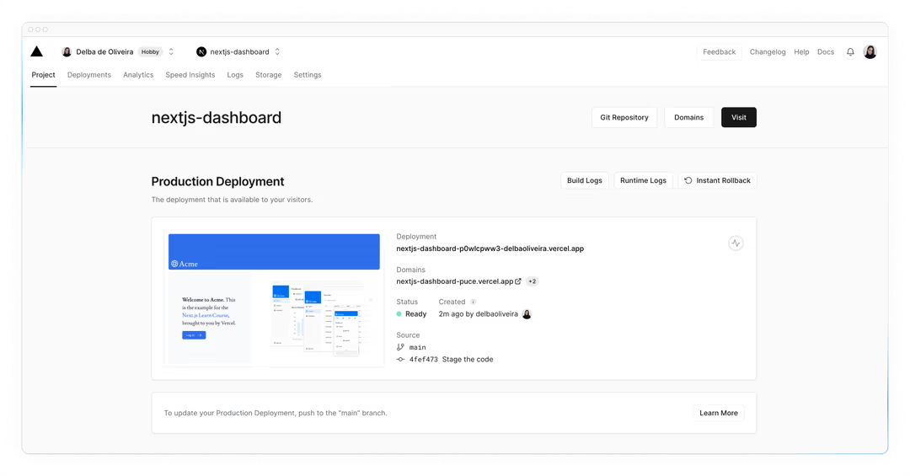

## Chapter 1 - Create a New Project

安装`pnpm`，通常来说比`npm`和`yarn`更快，更方便管理项目
```bash
npm install -g pnpm
```

创建一个Next.js app然后`cd`到该项目根目录下面：
```bash
npx create-next-app@latest nextjs-dashboard --example "https://github.com/vercel/next-learn/tree/main/dashboard/starter-example" --use-pnpm
```

```bash
cd nextjs-dashboard
```

在开发环境中测试当前app
```bash
pnpm i
pnpm dev
```
然后打开http://localhost:3000/


## Chapter 2 - CSS Styling
主要讲述：
- 如何添加global CSS 文件
  - 该项目中`/app.ui`文件夹下面的`global.css`中定义了全局格式。在`/app/layout.tsx`中导入`global.css`即可使用
  ```tsx
  //  /app/layout.tsx 
  import '@/app/ui/global.css';
 
  export default function RootLayout({
    children,
  }: {
    children: React.ReactNode;
  }) {
    return (
      <html lang="en">
        <body>{children}</body>
      </html>
    );
  }
  ```
- Tailwind和CSS Modules 这两种CSS styling的方式
  - 下面是使用tailwind的案例：
  ```tsx
  // /app/page.tsx
  import AcmeLogo from '@/app/ui/acme-logo';
  import { ArrowRightIcon } from '@heroicons/react/24/outline';
  import Link from 'next/link';
  
  export default function Page() {
    return (
      // These are Tailwind classes:
      <main className="flex min-h-screen flex-col p-6">
        <div className="flex h-20 shrink-0 items-end rounded-lg bg-blue-500 p-4 md:h-52">
      // ...
    )
  }
  ```
  然后将下面的代码添加到`/app/page/tsx`文件的`<p>` tag上面一行：
  ```tsx
  <div
    className="relative w-0 h-0 border-l-[15px] border-r-[15px] border-b-[26px] border-l-transparent border-r-transparent border-b-black"
  />
  ```
  - 下面是如何使用css module。首先是要在`/app/ui`文件夹下面创建一个`home.module.css`文件，并添加下面代码：
  ```css
  .shape {
    height: 0;
    width: 0;
    border-bottom: 30px solid black;
    border-left: 20px solid transparent;
    border-right: 20px solid transparent;
  }
  ```
  然后在`/app/page.tsx`下面：
  ```tsx
  import AcmeLogo from '@/app/ui/acme-logo';
  import { ArrowRightIcon } from '@heroicons/react/24/outline';
  import Link from 'next/link';
  import styles from '@/app/ui/home.module.css';
  
  export default function Page() {
    return (
      <main className="flex min-h-screen flex-col p-6">
        <div className={styles.shape} />
      // ...
    )
  }
  ```
  这样就表示将`.shape`所有的样式都赋予给`<div>` tag。
- 如何通过`clsx`包 来添加 conditional class。最常见的就是invoice的状态可以是'pending'或者'paid'。`/app/ui/invoice/status.tsx`中就定义了invoice状态变动的条件，如下：
  ```tsx
  import clsx from 'clsx';

  export default function InvoiceStatus({ status } : { status : string}) {
    return (
      <span
        className={clsx(
          'inline-flex items-center rounded-ful px-2 py-1 text-sm',
          {
            'bg-gray-100 text-gray-500': status === 'pending',
            'bg-green-500 text-white': status === 'paid',
          },
          )}
      >
      // ...
    )
  }
  ```


## Chapter 3 - Optimizing Fonts and Images
### 3.1. 如何在`next/font`中添加自定义的字体？
优化字体主要就是出于对网站performance的考量。Google使用的指标是[Cumulative Layout Shift](https://vercel.com/blog/how-core-web-vitals-affect-seo)，来衡量一个网站的performance和user experience。使用Next.js的好处是，它通过`next/font`来自动优化你网站的字体。

1. **Adding a Primary Font**: 在`app/ui`文件夹下面创建`fonts.ts`，然后添加下面代码：
```ts
import { Inter } from 'next/font/google'

export const Inter = Inter({ subsets: ['latin'] });
```
最后，将刚刚创建的`Inter`字体导入`/app/layout.tsx`如下：
```tsx
import '@/app/ui/global.css';
import { inter } from '@/app/ui/fonts';
 
export default function RootLayout({
  children,
}: {
  children: React.ReactNode;
}) {
  return (
    <html lang="en">
      <body className={`${inter.className} antialiased`}>{children}</body>
    </html>
  );
}
```

2. **Adding a Secondary Font**：
对`/app/ui/fonts.ts`进行如下修改。注意的是Lusitana字体要求给定`weight`参数（详见Google Fonts）
```tsx
// /app/ui/fonts.ts
import { Inter, Lusitana } from 'next/font/google';
 
export const inter = Inter({ subsets: ['latin'] });   // priamry font

// weight parameter is necessary because it's required by Google Font
export const lusitana = Lusitana({ subsets: ['latin'], weight: ['400', '700'] }); // secondary font

```
### 3.2. 如何在`next/image`中添加图片？
Next.js提供了static assets，例如图片等。它们被放在`/public`文件夹下面。
```tsx

```

这也就意味着你需要手动配置如下条目：
* 确保图片在不同屏幕大小下是responsive的
* 为不同大小的设备指定图片大小
* 防止页面layout随着图片的加载发生shift
* lazy load位于用户viewport之外的图片

1. `<Image>` Component

2. 添加desktop hero image - `/public`文件夹下面有`hero-desktop.png`和`hero-mobile.png`两个图片。在`/app/page.tsx`中：
```tsx
import AcmeLogo from '@/app/ui/acme-logo';
import { ArrowRightIcon } from '@heroicons/react/24/outline';
import Link from 'next/link';
import { lusitana } from '@/app/ui/fonts';
import Image from 'next/image';       // newly added 
 
export default function Page() {
  return (
    // ...
    <div className="flex items-center justify-center p-6 md:w-3/5 md:px-28 md:py-12">
      {/* Add Hero Images Here */}
      <Image             // newly added 
        src="/hero-desktop.png"
        width={1000}
        height={760}
        className="hidden md:block"
        alt="Screenshots of the dashboard project showing desktop version"
      />
    </div>
    //...

    // Practice - Adding another image:
    <div className="flex items-center justify-center p-6 md:w-3/5 md:px-28 md:py-12">
      <Image 
        src="/hero-mobile.png"
        width={560}
        height={620}
        className="block md:hidden"
        alt="Screenshots of the dashboard project showing mobile version"
      />
    </div>
  );
}
```
上面代码里将图片大小设置成1000x760，这样可以避免layout shift。
上面的`hidden`类表示将 该图从手机屏幕的DOM上移除。`md:block`表示在桌面端屏幕上显示该图片

### 3.3. 如何在Next.js中优化字体和图片？
上面的 `//Practice` 的部分值得一看。此外就是对于`md:hidden`的使用。这里表示当用户使用了桌面端则显示`/hero-desktop.png`，如果是移动端则显示`/hero-mobile.png`。


## Chapter 4 - Creating Layouts and Pages

Next.js使用的是**file-system routing**，文件夹用来创建嵌套式的路由。每个文件夹都表示一个**route segment**，它会映射到一个**URL segment**

此外，前面多次提到的`page.tsx`和`layout.tsx`是用来为每个 route 创建UI的。`page.tsx`可以导出一个React Component。`/app/page.tsx`文件是一个连接到`/`路由的homepage。

要创建嵌套式路由，你可以在每一个文件夹下面都创建一个`page.tsx`


我们尝试创建新的`/app/dashboard/page.tsx`文件如下：
```tsx
export default function Page() {
  return <p>Dashboard Page</p>;
}
```

然后创建新的`/app/dashboard/customers/page.tsx`和`/app/dashboard/invoices/page.tsx`文件如下：
```tsx
export default function Page() {
  return <p>Customers Page.</p>
}
```

```tsx
export default function Page() {
  return <p>Invoices Page.</p>
}
```

然后你就可以看到刚刚创建的http://localhost:3000/dashboard，http://localhost:3000/dashboard/customers 和 http://localhost:3000/dashboard/invoices 这三个页面了。


### Creating the dashboard Layout
Dashboard中包含的是多个页面之间共享的navigation。在Next.js中，你可以通过`layout.tsx`文件来创建多个页面之间共享的UI。我们来看下面的例子：

首先在`/dashboard`文件夹下面创建一个新的文件`layout.tsx`
```tsx
import SideNav from '@/app/ui/dashboard/sidenav';

export default function Layout({ children }: { children: React.ReactNode }) {
  return (
    <div className="flex h-screen flex-col md:flex-row md:overflow-hidden">
      <div className="w-full flex-none md:w-64">
        <SideNav />
      </div>

      <div className='flex-grow p-6 md:overflow-y-auto md:p-12'>{children}</div>
    </div>
  );
}
```
这段代码中，我们先导入了`<SideNav />`组件。被导出的`<Layout />`组件会接受一个`children` prop。该prop可以是一个 page也可以是另一个layout。在上面代码案例中，`/dashboard`文件夹里面的pages会自动被嵌套在一个`<Layout />`组建中。即，如下图所示，你会看到`/dashboard`下面的`invoices/page.tsx`和`customers/page.tsx`以及`/dashboard/page.tsx`三个页面都自动被嵌套在`/dashboard/layout.tsx`下面了。最终效果如下图：


使用layouts的一大优点就是在navigation中，只有page 组件会被更新，而layout本身不会被re-render，这也就是所谓的partial rendering。这样一来就能保留下client-side 的React state。


### Root Layout
在Chapter 3中，我们倒入了`Inter`字体到另一个layout `/app/layout.tsx`中，如下：
```tsx
import '@/app/ui/global.css';
import { inter } from '@/app/ui/fonts';
 
export default function RootLayout({
  children,
}: {
  children: React.ReactNode;
}) {
  return (
    <html lang="en">
      <body className={`${inter.className} antialiased`}>{children}</body>
    </html>
  );
}
```
该方式称为[root layout](https://nextjs.org/docs/app/api-reference/file-conventions/layout#root-layouts)，且在每一个Next.js应用中都需要这样做。任何被添加到`root layout`中的UI都会在你的应用中的每一个page之间被共享。


## Chapter 5 - Navigating Between Pages
1. How to use the next/link component.
2. How to show an active link with the usePathname() hook.
3. How navigation works in Next.js.

### Why Optimize Navigation?
传统网站都是用`<a></a>`来建立各个页面之间的联系。但是在我们创建的应用中，当我们在customers, home, invoices页面之间切换时，每次切换，页面都会fully refresh。


### The `<Link>` Component
在Next.js中，你可以使用`<Link />`组件建立页面之间的连接。这可以让你使用Javascript进行client-side navigation。你可以打开`/app/ui/dashboard/nav-links.tsx`文件，导入`<Link />`组件，然后将`<a>`替换成`<Link />`。如下：
```tsx
// /app/ui/dashboard/nav-links.tsx
import {
  UserGroupIcon,
  HomeIcon,
  DocumentDuplicateIcon,
} from '@heroicons/react/24/outline';
import Link from 'next/link';
 
// ...
 
export default function NavLinks() {
  return (
    <>
      {links.map((link) => {
        const LinkIcon = link.icon;
        return (
          <Link
            key={link.name}
            href={link.href}
            className="flex h-[48px] grow items-center justify-center gap-2 rounded-md bg-gray-50 p-3 text-sm font-medium hover:bg-sky-100 hover:text-blue-600 md:flex-none md:justify-start md:p-2 md:px-3"
          >
            <LinkIcon className="w-6" />
            <p className="hidden md:block">{link.name}</p>
          </Link>
        );
      })}
    </>
  );
}
```
使用`<Link>`的好处就是，如果你再去你的网页上切换invoices, customers, home，页面不再是fully refresh了。这是因为：
1. 为了提高navigation 性能，Next.js会根据路由段(route segments)自动对应用进行代码拆分。这与传统的[React SPA](https://nextjs.org/docs/app/building-your-application/upgrading/single-page-applications)不同，在传统的React SPA中，浏览器在初始页面加载时加载所有应用程序代码。
按路由分割代码意味着页面被隔离。如果某个页面抛出错误，应用程序的其余部分仍将正常工作。这也减少了浏览器解析的代码，从而使应用程序更快。
此外，在生产环境中，只要`<Link>`组件出现在浏览器的视图中，Next.js就会自动在后台预取链接路由的代码。当用户单击链接时，目标页面的代码已经在后台加载，这使得页面转换几乎是即时的！


### Pattern: Showing active links
常见的UI Pattern是要显示一个active link来告诉用户他们当前所在的位置。这就需要获取的用户当前的URL path。Next.js提供了一个hook `usePathname()`，用来检查该path并且实现该pattern。

由于`usePathname()`是一个React hook，所以需要将`nav-links.tsx`转换成一个`Client` 组件。将React的"use client"指令Tina驾到文件顶部，然后从`/next/navigation`中导入`usePathname()`如下：
```tsx
// /app/ui/dashboard/nav-links.tsx
'use client';

import {
  UserGroupIcon,
  HomeIcon,
  DocumentDuplicateIcon,
} from '@heroicons/react/24/outline';
import Link from 'next/link';
import { usePathname } from 'next/navigation';

// ...
```
然后将该路径分配给`<navLinks />`组件里面的`pathname`如下：
```tsx
// /app/ui/dashboard/nav-links.tsx
export default function NavLinks() {
  const pathname = usePathname();
}
```

使用`clsx`库可以添加 有条件的CSS样式。例如，当`link.href`与`pathname`匹配的时候，该link要显示成蓝色字样。如下：
```tsx
// /app/ui/dashboar/nav-links.tsx
'use client';
 
import {
  UserGroupIcon,
  HomeIcon,
  DocumentDuplicateIcon,
} from '@heroicons/react/24/outline';
import Link from 'next/link';
import { usePathname } from 'next/navigation';
import clsx from 'clsx';
 
// ...
 
export default function NavLinks() {
  const pathname = usePathname();
 
  return (
    <>
      {links.map((link) => {
        const LinkIcon = link.icon;
        return (
          <Link
            key={link.name}
            href={link.href}
            className={clsx(
              'flex h-[48px] grow items-center justify-center gap-2 rounded-md bg-gray-50 p-3 text-sm font-medium hover:bg-sky-100 hover:text-blue-600 md:flex-none md:justify-start md:p-2 md:px-3',
              {
                'bg-sky-100 text-blue-600': pathname === link.href,
              },
            )}
          >
            <LinkIcon className="w-6" />
            <p className="hidden md:block">{link.name}</p>
          </Link>
        );
      })}
    </>
  );
}
```


## Chapter 6 - Setting Up Your Database
该教程将会使用PostgreSQL作为数据库案例。你可以在[Vercel's marketplace integrations](https://vercel.com/marketplace?category=storage)里面找到。当然如果你有自己prefer的数据库的话也可以使用你自己喜欢的数据库。

这章中，我们会讨论：
1. 如何将当前项目push到Github上
2. 设置Vercel账号，然后将其与你的GitHub repo连接，从而方便你实时查看网站的preview和deployment
3. 创建和建立从你的项目到数据库之间的连接
4. 给数据库发送初始化数据

### 创建GitHub repo：
就简单的follow [这篇官方教程](https://docs.github.com/en/repositories/creating-and-managing-repositories/quickstart-for-repositories)来创建GitHub repo即可


### 然后创建一个Vercel账号
选择免费的hobby plan。推荐在创建的过程中建立起Vercel与GitHub帐号之间的联系。最后结果如下图：


<span style="color: cyan">这样做的好处就是你可以每次git push之后，直接看到公开的网站更新，而不是只能在本地查看</span>。另外要注意的是，这个GitHub repo必须是 public的才能看到。

### 创建一个Postgres 数据库


如下图，我们在Storage下面找到数据库。你可以用Neon或者Supabase都可以。


建立连接之后，找到`.env.local`页面，点击**Show secret**和**Copy Snippet**。确保你复制了这些代码


> ⚠️另外需要注意的是，你最好去到`.gitignore`文件下面，确保`.env`文件被添加到`.gitignore`下面，避免重要信息泄漏。

最后，将复制的代码放到`.env.example`文件中。最后将该文件重命名为`.env`

### Seed your database

有了数据库之后，我们创建一个种子来初始化数据。我们包含了一个可以在浏览器中访问的API，它将运行一个种子脚本，用一组初始数据填充数据库。

该脚本使用SQL创建表，并从`placeholder-data.ts`文件中中获取数据。在创建它们之后填充它们。

确保您的本地开发服务器正在运行`pnpm run dev`，并在浏览器中导航到`localhost:3000/seed`。完成后，您将在浏览器中看到一条消息"Database seeded successfully"。完成后，您可以删除此文件。


这时候，如果你再去到 Neon 中所对应的项目下面就会看到你刚刚新创建了几个table如下：


